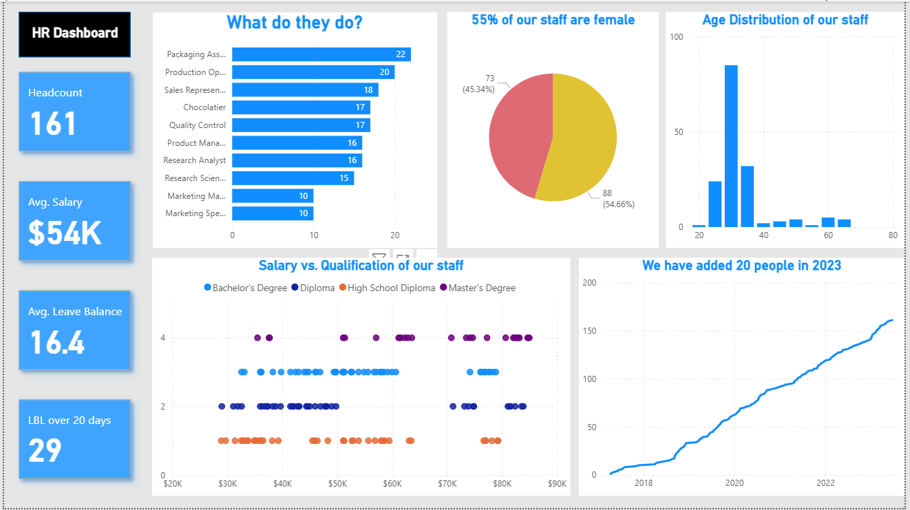

# HR-Analytics

## Objective
This project aims at looking into HR data and perform analysis and prepare dashboard.

## Some Important Analysis
1. How many people are in each job?
2. Gender break-down of the staff
3. Age spread of the staff
4. Which jobs pay more?
5. Top earners in each job
6. Qualifications vs. Salary
7. Staff growth trend over time
8. Leave balance analysis
9. Quick HR dashboard

## Dashboard

